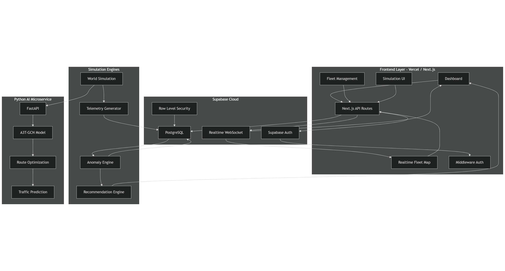

# Orchestration Layer

Operational orchestration documentation for the Digital Twin Emergency Vehicles platform.

---

# System Architecture

---

# Overview

This orchestration layer coordinates:

- telemetry ingestion
- realtime synchronization
- anomaly detection
- simulation services
- AI route optimization

The platform is deployed using:

- Vercel
- Supabase
- FastAPI
- A3T-GCN

---

# Included Files

| File | Description |
|---|---|
| architecture.png | Final system architecture diagram |
| workflow.md | Operational workflow definition |
| security.md | Security and access control decisions |
| run_pipeline.sh | Local orchestration helper script |

---

# Main Operational Flow

1. Telemetry generation
2. Telemetry ingestion
3. Realtime synchronization
4. Anomaly detection
5. Incident simulation
6. AI route optimization
7. Frontend visualization